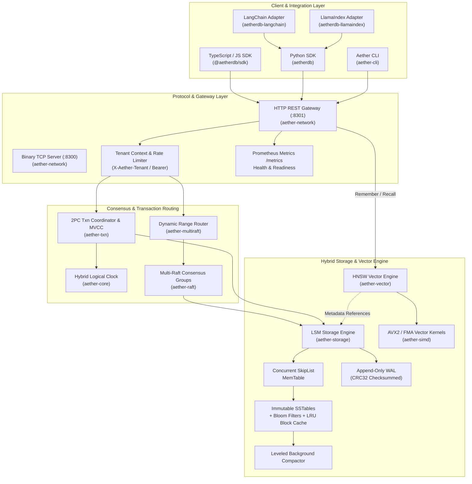

# AetherDB Technical Architecture Specification

> **"AetherDB is the persistent memory and state layer for autonomous AI applications."**

---

## 1. Executive Architectural Overview

Autonomous AI agents require a fundamentally different storage substrate than traditional relational OLTP databases or standalone vector indices. They require:
- **Crash-Consistent Structured State:** Epistemic task progress, scratchpad context, and execution status.
- **Hardware-Atomic Execution Counters:** Lock-free tracking of LLM tokens, step limits, and rate quotas.
- **Persistent Semantic Memory:** Sub-millisecond vector similarity search paired with structured canonical metadata.
- **Distributed Replication & Transactions:** Multi-Raft consensus sharding with Snapshot Isolation (MVCC) and Two-Phase Commit (2PC).



---

## 2. Subsystem Deep-Dive

### 2.1 Structured Agent State (`__agent_state:<agent_id>:<key>`)
- **Namespacing:** Keys are automatically prefixed with the active tenant identifier (`t:<tenant_id>:`) and agent namespace (`__agent_state:<agent_id>:<key>`).
- **MemTable & WAL Ingestion:** Mutations are written sequentially to an append-only write-ahead log with CRC32 integrity checksums before updating the concurrent SkipList MemTable.
- **SSTable Flushes:** When MemTable capacity reaches the flush threshold, an immutable SSTable is written with 4KB indexed data blocks, binary search indexes, and 10-bit-per-key Bloom filters for $O(1)$ negative lookup elimination.

### 2.2 Semantic Memory (`agent.memory.remember` & `agent.memory.recall`)
- **Dual-Storage Invariant:**
  1. **Canonical Structured Record:** Text content, Unix millisecond timestamps, and arbitrary JSON metadata are written transactionally to the LSM engine under `__agent_mem:<agent_id>:<memory_id>`.
  2. **Hierarchical Navigable Small World (HNSW) Index:** Vector embeddings are inserted into an in-memory graph index (`aether-vector`) partitioned by tenant and agent prefix.
- **Hardware-Accelerated Similarity Search:** Distance computations utilize zero-copy AVX2/FMA vector dot product and cosine similarity SIMD routines (`aether-simd`), processing 4096-dimensional vectors in sub-millisecond latencies.

### 2.3 Hardware-Atomic Token Accounting (`agent.state.incr`)
- Token quotas, cost microcents, and step loops are incremented via single-key WAL serialization and atomic in-memory CAS primitives.
- Ensures linearizability under high-concurrency multi-threaded agent execution loops without heavy distributed locks.

### 2.4 Distributed Multi-Raft & Transactions
- **Multi-Raft Consensus:** The key space is sharded into dynamic key ranges, each governed by an independent Raft consensus group.
- **MVCC & Hybrid Logical Clocks:** Every write intent is stamped with a causally monotonic HLC timestamp, providing Snapshot Isolation (SI) reads without distributed locking.
- **Distributed Two-Phase Commit (2PC):** Cross-range mutations execute through a distributed 2PC coordinator with Prepare, Commit, and Abort state machine invariants.

---

## 3. Multi-Tenant & Multi-Agent Security Model

AetherDB enforces a 3-layer cryptographic and hierarchical isolation boundary:

```text
Tenant Isolation (X-Aether-Tenant: <tenant_id> or Bearer aether_sk_<tenant>_<token>)
 └── Agent Namespace Isolation (agent_id)
      ├── Structured State Partition (__agent_state:<agent_id>:*)
      ├── Semantic Memory Partition (__agent_mem:<agent_id>:*)
      └── Filtered Vector Index (t:<tenant_id>:agent:<agent_id>:*)
```

- Cross-tenant queries are blocked at the HTTP gateway layer.
- Cross-agent memory recalls are filtered at the SIMD vector traversal kernel layer.
- State deletion strictly operates on the target agent's key prefix without affecting other agent partitions.
